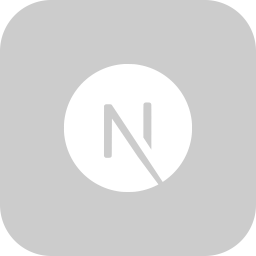

<br/>

# Hey There 👋🏻
```yaml
<Quick Introduction>

Greetings! My name is Critical_DevX and I'm a skilled Programmer and Full Stack Developer.
```


- 🔭 **Currently,** I am engrossed in the realm of web development.
- 🌱 **Presently,** I am expanding my knowledge in discord.js, machine learning next.js.

### Programming Languages and Tools
<a href="https://code.visualstudio.com/" target="_blank"></a>
<a href="https://developer.mozilla.org/en-US/docs/Web/JavaScript" target="_blank"></a>
<a href="https://nodejs.org/" target="_blank"></a>
<a href="https://nextjs.org/" target="_blank"></a>
<br/><br/>
<a href="https://www.mongodb.com/" target="_blank"></a>
<a href="https://git-scm.com/" target="_blank"></a>
<a href="https://github.com/" target="_blank"></a>
<a href="https://tailwindcss.com/" target="_blank"></a>
<br/>
